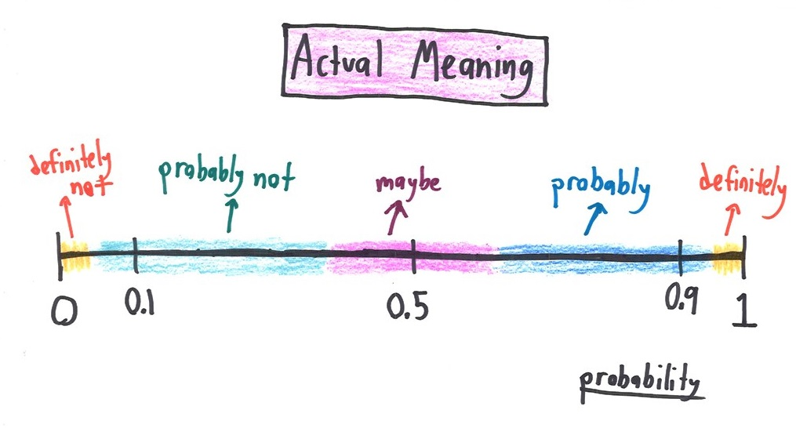
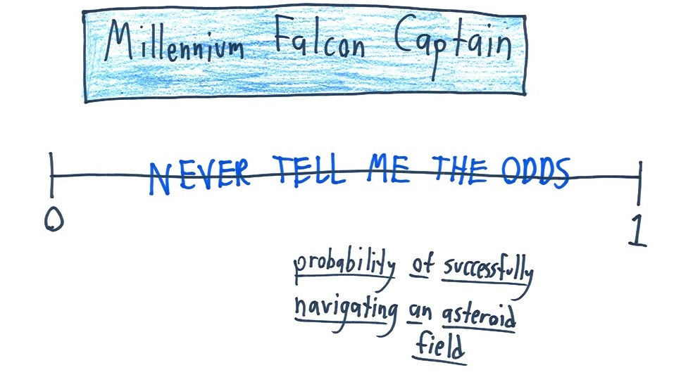

> Statistical inference is concerned with drawing conclusions, from numerical data, about quantities that are not observed. -- Gelman et al **BDA3**: 4.

> Bayesian data analysis is just a logical procedure for processing information. -- McElreath **Statistical Rethinking**: 12.


# Objectives

- What defines a (Bayesian) model?
- Introduce the logic behind Bayesian updating.
- Dip our toes into numerical methods using **brms**.
- Basics of summarizing a posterior distribution using **tidybayes**.


# Preface

We're going to be using the [tidyverse](https://www.tidyverse.org) for data wrangling, and [brms](https://github.com/paul-buerkner/brms) for modeling. Discussion and activities are derived from 
[**Statistical Rethinking** by Richard McElreath](https://xcelab.net/rm/statistical-rethinking/), 
[**Bayesian Data Analysis 3** by Gelman et al.](http://www.stat.columbia.edu/~gelman/book/), and 
[**Data Analysis Using Regression and Multilevel/Hierarchical Models** by Gelman and Hill](https://www.cambridge.org/core/books/data-analysis-using-regression-and-multilevelhierarchical-models/32A29531C7FD730C3A68951A17C9D983). 

I'm also using code examples from [this rewriting](https://github.com/ASKurz/Statistical_Rethinking_with_brms_ggplot2_and_the_tidyverse) of **Rethinking**.

```{r results = 'hide'}
library(tidyverse)
library(brms)
library(tidybayes)
```


# Learning from data

Bayesian inference is a fancy way of counting and comparing possibilities. As we collect and analyze our data, we learn which possibilities are more plausible than others.


## Counting and plausibility

We're going to use a simple example from **Statistical Rethinking** to start thinking about Bayesian analysis.

**Setup**: We've got a bag with four marbles. Each marble can be either blue (B) or white (W). We don't know the composition of the bag. Our goal is to figure out which of possible configuration is most plausible, given whatever evidence we learn about the bag. A sequence of three marbles have pulled from the bag, one at a time, then returned to the bag, and the bag is shaken before drawing another. We draw the sequence [B W B]. 

How many ways are their to produce this draw? Try with the possible bag compositions [B W W W]. 

Here is the full table of ways to produce that draw given each possible bag composition.

| conjecture | ways to produce [B W B] |
|---|---|
| [W W W W] | 0 x 4 x 0 = 0 |
| [B W W W] | 1 x 3 x 1 = 3 |
| [B B W W] | 2 x 2 x 2 = 8 |
| [B B B W] | 3 x 1 x 3 = 9 |
| [B B B B] | 4 x 0 x 4 = 0 |


What happens when we draw another marble? We update the counts! How do we update the counts? We multiply the prior counts by the new count! The old counts are acting as our prior counts. Here is an example of drawing an additional [B].

| conjecture  | ways to produce [B]  | previous counts  | new count  |
|---|---|---|---|
| [W W W W] | 0 | 0 | 0 x 0 = 0 |
| [B W W W] | 1 | 3 | 3 x 1 = 3 |
| [B B W W] | 2 | 8 | 8 x 2 = 16 |
| [B B B W] | 3 | 9 | 9 x 3 = 27 |
| [B B B B] | 4 | 0 | 0 x 4 = 0 |


Logically, what we've just done can be expressed as

<center>
  plausibility of [B W W W] after seeing [B W B] $\propto$ ways [B W W W] can produce [B W B] X prior plausibility of [B W W W].
</center>

But these are just counts and plausibilities; we want probabilities! First, let's define $p$ as proportion of blue marbles in the bag and $D_{new}$ as the data. We now have: 

<center>
  plausibility of $p$ after $D_{new}$ $\propto$ ways $p$ can produce $D_{new}$ X prior plausibility of $p$.
</center>


We the standardize the plausibility so that the sum of the plausibilities for all conjectures sums to 1. To standardize, we add up all the products, one for each $p$, then divide each product by the sum of the products.

| possible combinations | $p$ | ways to produce data | plausibility |
|---|---|---|---|
| [W W W W] | 0 | 0 | 0 |
| [B W W W] | 0.25 | 3 | 0.15 |
| [B B W W] | 0.5 | 8 | 0.40 |
| [B B B W] | 0.75 | 9 | 0.45 |
| [B B B B] | 1 | 0 | 0 |

This process is equivalent to 

<center>
  plausibility of $p$ after $D_{new}$ = (ways $p$ can produce $D_{new}$ X prior plausibility $p$) / sum of products
</center>


Each part of the calculations we've done correspond directly to quantities in applied probability theory.

- The conjectured proportion of blue marbles, $p$, is usually called a *parameter*. 
- The relative number of ways that $p$ can produce the data is usually called the *likelihood*.
- The prior plausibility of a specific $p$ is called the *prior probability*.
- The updated plausibility of any specific $p$ is called the *posterior probability*.


## Building a model

Bayesian inference is made easier by working with probabilities instead of counts, but it looks a lot harder.

**Setup**: We've a globe with land and water sections. We want to know how much of the globe is water. Our strategy is to throw the globe up, catch it, and note the surface under the right index finger. Let's do this 9 times.

```{r}
d <- tibble(toss = c("w", "l", "w", "w", "w", "l", "w", "l", "w"))

# then rephrase in terms of trials and count of water
(d <- d %>% 
 mutate(n_trials  = 1:9,
        n_success = cumsum(toss == "w")))
```

To get the logic machinery working, we need to make assumptions, and these assumptions constitute the model. An ideal design loop for designing a Bayesian model has three steps

1. **Data story** 
    - Describe aspects of the underlying reality as well as the sampling process. 
    - Then translated into a formal probability model.
    - Framework for interpretation, but still a story.
    - Helps with realizing additional questions that must be answered because hypotheses are frequently vague.
2. **Updating**
    - Bayesian models begin with a set of plausibilities assigned to each possibility (*Prior*).
    - Update those plausibilities based on the data to give *posterior* plausibility.
3. **Evaluate**
    - Certainty is no guarantee that the model is good or accurate.
    - Supervise and critique your model!
    - Check model's adequacy for some purpose, or in light of stuff we don't know.


### A data story

How did the data come to be? Describe aspects of the underlying reality as well as the sampling process, sufficient enough for specifying an algorithm to simulate new data. Write out the data story for this activity.


### Bayesian updating

A Bayesian model begins with one set of plausibilities assigned to each possible result, the prior plausibilities. These values are then updated in light of data to produce posterior plausibilities. This process is *Bayesian updating*.

```{r}
sequence_length <- 50                  # how many points to calculate prob for

d %>% 
  expand(n_trials, 
         p_water = seq(from = 0, to = 1, length.out = sequence_length)) %>% 
  left_join(d, by = "n_trials") %>%
  group_by(p_water) %>% 
  # lag is the *previous* value
  mutate(lagged_n_success = lag(n_success, k = 1), 
         lagged_n_trials  = lag(n_trials,  k = 1)) %>% 
  # if first time, flat prior. 
  # otherwise use previous posterior as new prior.
  ungroup() %>% 
  mutate(prior = ifelse(n_trials == 1, 
                        .5,
                        dbinom(x = lagged_n_success, 
                               size = lagged_n_trials, 
                               prob = p_water)),
         strip = str_c("n = ", n_trials), # which draw is it?
         likelihood = dbinom(x = n_success, 
                             size = n_trials, 
                             prob = p_water)) %>% # calculate likelihood for current draw
  # normalize the prior and the likelihood, making them probabilities 
  group_by(n_trials) %>% 
  mutate(prior = prior / sum(prior),
         likelihood = likelihood / sum(likelihood)) %>%   
  ggplot(aes(x = p_water)) +
  geom_line(aes(y = prior), linetype = 2) +
  geom_line(aes(y = likelihood)) +
  scale_x_continuous("proportion water", breaks = c(0, .5, 1)) +
  scale_y_continuous("plausibility", breaks = NULL) +
  facet_wrap(~strip, scales = "free_y")
```


Side note on sample size. Bayesian estimates are valid and interpretable at any sample size. This is very much in contrast to the folk-wisdom around a minimum number of samples you'll hear in non-Bayesian contexts. In non-Bayesian contests, statistical inference is justified by behaviour at large samples sizes, called asymptotic behaviour. The reason Bayesian estimates are always valid and interpretable comes down to the prior. If the prior is bad, the resulting posterior could be misleading. Regardless, all estimates in either context are based on assumptions.


### Evaluate

Our model is learning from a "small world" of data. If there are important differences between the model and reality, then there is no guarantee of "large world" performance.

Certainty is no guarantee that the model is good. As data increases, our model will become increasingly sure of the proportion of water. This sureness happens even if the model is seriously misleading because our estimates are conditional on our model. What our model is saying is that, given that we're using a specific model, we can be sure that plausible values are within a narrow range.


You've got to supervise and critique your model, and not just assume it worked or is correct. Anything in not included in our model might not affect our inference directly, but it might affect it indirectly because of that unmodeled dependence. For example, we currently are assuming that the order the data was collected in doesn't matter (exchangeable), but what if the order of the observations actually did matter? Check the model's inferences in light of aspects of the data that you know but the model doesn't know about. This part of data analysis is an inherently creative endeavor that is up to you (the analyst) and your scientific community. Robots can't do this step for you.

The goal when evaluating your model is not the test the truth of the model's assumptions. Our model's assumptions are never exactly right and are not the true data generating process. Failure to prove the model false is a failure of our imagination, not a success of the model. Additionally, a model doesn't have to be true in order to produce precise and useful inferences. Models are information process machines, and there are parts of information that cannot be easily represented by framing our problem in terms of the truth of assumptions.

Instead, our objective should be to test the model's adequacy for some *purpose*. What are we trying to learn? This means asking and answering more questions than those originally used to construct our model. Think about what you know as a domain expert and compare it to your model; if there is a conflict you should update your model (likelihood and/or prior) to better reflect your domain knowledge. It is hard to give general advice on model evaluation is that there are lots of different contexts for evaluating the adequacy of a model -- prediction, comprehension, measurement, persuasion. These are inherently *scientific questions*, not statistical questions. As I said earlier, robot's can't do this step for you.


# Terms and theory

- **Common notation**
    - $y$ observed data.
    - $\tilde{y}$ unobserved data.
    - $X$ explanatory variables, covariates, etc.
    - $\Theta$ parameters of interest.
    - $p(\cdot|\cdot)$ conditional probability distribution.
    - $p(\cdot)$ marginal probability distribution.
    - $p(\cdot,\cdot)$ joint probability distribution.
    - $Pr(\cdot)$ probability of an event.
- **Likelihood**
    - Specifies the plausibility of data mathematically. 
    - Maps each conjecture onto the relative number of ways the data could occur, given that possibility.
    - Sometimes written $p(y | \Theta)$ or $L(\Theta | y)$.
- **Parameters**
    - Adjustable inputs.
    - 1+ quantities we want to know about.
    - Represent the different conjectures for causes or explanations of the data
    - Difference between data and parameters is fuzzy and exploitable in Bayesian analysis --> advanced topic
- **Prior**
    - Every parameter you are trying to estimate must be provided a prior.
    - The "initial conditions" of the plausibility of each possibility.
        - Which parameters values do we think are more plausible than others?
        - Constrain parameters to reasonable ranges.
        - Express any knowledge we have about that parameter before any data is observed.
    - An engineering assumption; helps us learn from our data.
    - Regularizing or weakly informative priors are conservative in that they tend to guard against inferring strong associations between variables --> Advanced topics
    - Sometimes written $p(\Theta)$.
- **Posterior**
    - Logical consequence of likelihood, which parameters to estimate, and priors for each parameter.
    - The relative plausibility of different parameter values, conditional on the data
    - Sometimes written $p(\Theta | y)$.


## Bayes' Theorem 

The logic defining the posterior distribution is called Bayes' Theorem. The theorem itself is an intuitive result from probability theory.

First, describe the model and data as a joint probability. 
$$
\begin{align}
p(y, \Theta) &= p(\Theta | y) p(y) \\
p(y, \Theta) &= p(y | \Theta) p(\Theta) \\
\end{align}
$$

Then set equal to each other and solve for $p(\Theta | y)$:
$$
\begin{align}
p(\Theta | y) p(y) &= p(y | \Theta) p(\Theta) \\
p(\Theta | y) &= \frac{p(y | \Theta) p(\Theta)}{p(y)} \\
\end{align}
$$

Et voilà, Bayes' Theorem. The probability of any particular value of $\Theta$, given the data, is equal to the product of the likelihood and the prior, divided by $p(y)$.

"But what's $p(y)$?" you ask. The term $p(y)$ is a confusing one -- it can be called the "average likelihood," "evidence," or "probability of the data." The average likelihood here means it is averaged over the prior and its job is to standardize the posterior so it integrates to 1. $p(y)$ is expressed mathematically as:

$$
p(y) = E(p(y | \Theta)) = \int p(y | \Theta) p(\Theta) d\Theta
$$

$E(\cdot)$ means to take the expectation, a (weighted) average. Notice also that $p(y)$ is a type of marginal probability distribution; the process of integrating out a term ($\Theta$) is called marginalization -- we are averaging $y$ over all values of $\Theta$. An integral is like an average over a continuous distribution of values.


## But how does it *work*?

Our model has three parts: likelihood, parameters, and the prior. These values get put into an "motor" that gives a posterior distribution -- the motor goes through the process of conditioning the prior on the data.

Turns out that knowing all the rules doesn't necessarily help us with the calculations. For most interesting models we will ever considered, the necessary integrals in the Bayesian conditioning machinery have no closed form and can't be calculated no matter how talented you are. Instead, we need to rely on numerical techniques to approximate the mathematics defined in Bayes' theorem.

All of the numerical techniques we use produce only samples from this distribution, not the distribution itself. Luckily, samples from the distribution are easier to work with than the actual distribution. This way we don't have to do integrals.


### Grid approximation

One of the simplest conditioning techniques is grid approximation. While most parameters are continuous, we can get a decent approximation of them by consider only a finite grid of parameter values. For any particular value $p'$, compute the posterior probability by multiplying the prior probability of $p'$ by the likelihood of $p'$.

Grid approximation is a teaching tool that forces you to really understand the nature of Bayesian updating. You will probably never use it in your actual work. As a method, grid approximation scales very poorly as the number of parameters increases.

How to do grid approximation: 

1. Define a grid (range of values to look at). 
2. Compare the value of the prior at each parameter value of the grid.
3. Compute the likelihood at each parameter value.
4. Compute the unstandardized posterior at each parameter, but multiplying the prior by the likelihood.
5. Standardize the posterior by dividing each value by the sum of all values.

The number of points you evaluate on the grid determines the precision of your estimates. More points, finer grained posterior. 

For example, here's the posterior probability of the percent of water on the globe given our data evaluated at 5 points and 20 points.

```{r}
tibble(p_grid = seq(from = 0, to = 1, length.out = 5), # define grid
       prior = 1) %>%                  # define prior
  mutate(likelihood = dbinom(6, size = 9, prob = p_grid), # compute likelihood at each value in grid
         unstd_posterior = likelihood * prior, # computer product of likelihood and prior
         posterior = unstd_posterior / sum(unstd_posterior)) %>% # standardize the posterior, so it sums to 1
  # make a plot
  ggplot(aes(x = p_grid, y = posterior)) +
    geom_point() +
    geom_line() +
    labs(subtitle = "5 points",
         x = "probability of water",
         y = "posterior probability")
```

```{r}
tibble(p_grid = seq(from = 0, to = 1, length.out = 20), # define grid
       prior = 1) %>%                  # define prior
  mutate(likelihood = dbinom(6, size = 9, prob = p_grid), # compute likelihood at each value in grid
         unstd_posterior = likelihood * prior, # compute product of likelihood and prior
         posterior = unstd_posterior / sum(unstd_posterior)) %>% # standardize the posterior, so it sums to 1
  # make a plot
  ggplot(aes(x = p_grid, y = posterior)) +
    geom_point() +
    geom_line() +
    labs(subtitle = "20 points",
         x = "probability of water",
         y = "posterior probability")
```


### Markov chain Monte Carlo

For many models, grid approximation or quadratic approximation just aren't good enough. Grid approximation takes too long as your model gets bigger. Quadratic approximation chokes on complex models. Instead, we end up having to use a technique like Markov chain Monte Carlo (MCMC).

Unlike grid approximation, where we computed the posterior distribution directly, MCMC techniques merely draw samples from the posterior. You end up with a collection of parameter values, where the frequencies of those values correspond to the posterior plausibilities.

Let's do a quick example where we fit this model using **brms**. This package acts as an interface with [Stan probabilistic programming language](http://mc-stan.org/) which implements Hamiltonian Monte Carlo sampling, a fancy type of MCMC. The function `brm()` is the workhorse of the **brms** package, and builds and compiles a Stan model as defined in R. If you've used functions like `lm()` or `glm()`, some of the syntax should look familiar to you. 

```{r cache = T, message = F, results = 'hide'}
# this can take a bit as the model compiles
globe_brms <-
  brm(data = list(w = 24),             # generate data
      family = binomial(link = "identity"), # define likelihood distribution
      formula = w | trials(36) ~ 1,    # define parameter
      prior = prior(uniform(0, 1), class = Intercept), # give prior to parameter
      control = list(adapt_delta = 0.95), # control sampling behavior --> advanced topic
      refresh = 0,                     # silences a bunch of text
      iter = 2000,                     # how many draws from posterior? (default)
      warmup = 1000)                   # how many draws till we start recording (default)
```
```{r}
print(globe_brms)

# look at the posterior distribution of proportion water
globe_brms %>%
  spread_draws(b_Intercept) %>%
  ggplot(aes(x = b_Intercept)) +
  geom_line(stat = 'density') +
  scale_x_continuous('proportion water',
                     limits = c(0, 1)) +
  scale_y_continuous(NULL, breaks = NULL)
```


### Aside on Interpreting Probabilities

From [Math with Bad Drawings](mathwithbaddrawings.com/2015/09/23/what-does-probability-mean-in-your-profession/).






## Working with samples

In applied Bayesian analysis we rarely work directly with the integrals required by Bayes' theorem. Most numerical techniques we use, including MCMC methods, produce a set of samples -- individual draws from the joint posterior distribution. These samples transform a problem in calculus to a problem in data summary. It is easier to count samples within an interval then calculate an integral for that interval.

This section also serves as a brief introduction to **tidybayes**, which we will continue using in our next lesson.


Once our model produces a posterior distribution, the model's work is done. It is now *our* job to summarize and interpret that posterior. Common questions we might want to ask include:

- How much posterior probability lies below some parameter value?
- How much posterior probability lies between two parameter values?
- Which parameter value marks the lower 5% of the posterior probability?
- Which range of parameter values contains 90% of the posterior probability?
- Which parameter value has highest posterior probability?


### Intervals of defined boundaries

What is the posterior probability that the proportion of water is less than 50%? Count the number of observations that are less than 0.5, then divide by the number of samples.
```{r}
globe_brms %>%
	spread_draws(b_Intercept) %>%
	dplyr::summarize(p_val = sum(b_Intercept < 0.5) / length(b_Intercept))
```

What if we want to know the posterior probability that the proportion of water is between 0.5 and 0.75?
```{r}
globe_brms %>%
	spread_draws(b_Intercept) %>%
	dplyr::summarize(p_val = sum(b_Intercept > 0.5 & b_Intercept < 0.75) / length(b_Intercept))
```


### Intervals of defined mass

An interval of defined mass report two parameter values that contain between them the specified amount of posterior probability, a probability mass. You probably have heard of confidence intervals -- an interval of posterior probability is called a *credible interval*, though the distinction between the terms isn't terribly important.

There are two kinds of intervals of defined mass: percentile (or quantile) interval, and highest posterior density interval.


#### Percentile interval (PI)

For example, you may want to know the boundaries of the lower 80% posterior interval. This interval has to start at 0, but where does it stop? How do we calculate the 80th percentile?
```{r}
globe_brms %>%
  spread_draws(b_Intercept) %>%
  dplyr::summarize(q80 = quantile(b_Intercept, 0.8))
```

What about the middle 80% interval?
```{r}
# one way
(qu <- globe_brms %>%
  spread_draws(b_Intercept) %>%
  dplyr::summarize(q10 = quantile(b_Intercept, 0.1),
                   q90 = quantile(b_Intercept, 0.9)))

# another way
globe_brms %>%
  spread_draws(b_Intercept) %>%
  select(b_Intercept) %>%
  pull() %>%
  quantile(prob = c(0.1, 0.9))         
```

We can also plot this
```{r}
# plot the distribution
p1 <- globe_brms %>%
  spread_draws(b_Intercept) %>%
  ggplot(aes(x = b_Intercept)) +
  geom_line(stat = 'density') +
  scale_y_continuous(NULL, breaks = NULL) +
  scale_x_continuous(limits = c(0, 1))

# get back the density line calculation
p1_df <- ggplot_build(p1)$data[[1]]

# shade area under the distribution
p1 + geom_area(data = subset(p1_df, x > qu$q10 & x < qu$q90),
               aes(x=x,y=y),
               fill = "black", 
               color = NA) 
```


#### Highest posterior density interval 

An HPDI is defined as the narrowest interval containing the specified probability mass. There are an infinite of posterior intervals with the same mass, but what if you want that interval that best represents the parameter values most consistent with the data AND you want the densest of these intervals.

Here an example of a 50% HPDI
```{r}
globe_brms %>%
  spread_draws(b_Intercept) %>%
  select(b_Intercept) %>%
  pull() %>%
  hdi(.width = 0.5)

# compare to 50% PI
globe_brms %>%
  spread_draws(b_Intercept) %>%
  select(b_Intercept) %>%
  pull() %>%
  qi(.width = 0.5)
```
 
Why are the PI and HPDI not equal?

If the choice of interval makes a big difference in your summary, then you probably shouldn't be using intervals to summarize the posterior. The entire distribution is our actual estimate, the summaries are just there to help digest. Do not only work with simplified versions of our posterior estimates.


### Point estimates

Sometimes we only want a single point from the distribution. But given an entire posterior distribution, what value should we report? Mechanically, this task is simple -- pick a summary and go. Conceptually, this task is actually quite complex. The Bayesian parameter estimate is precisely the entire posterior distribution, and not just a single number. The posterior is a function that maps each unique parameter value onto a plausibility value. In most cases, it is unnecessary to choose a single point estimate. It is always better to report *more* than necessary about the posterior distribution than *less* than necessary. 

The three most common point estimates are the mean, median, and mode -- you're probably already familiar with all three of them. A principled way of choosing among these three estimates is considering as products of different *loss functions*. Loss functions are an advanced topic we will not cover today but I encourage you to read up on; here's a good [blog entry by John Myles White](http://www.johnmyleswhite.com/notebook/2013/03/22/modes-medians-and-means-an-unifying-perspective/).

The mode represents the parameter value with the highest posterior probability, or the *maximum a posteriori* estimate (MAP). In frequentist contexts, the maximum likelihood estimate is the equivalent to mode. Calculating the mode of a distribution is an optimization problem and isn't necessarily straight forward.

Here is a code snippet that gives a mode and a middle 95% percentile interval:
```{r}
globe_brms %>%
  spread_draws(b_Intercept) %>%
  select(b_Intercept) %>%
  mode_qi()
```

But we could also report a mean or median. Here are some ways to do get these estimates along with some kind of interval:
```{r}
# mean with 95% PI
globe_brms %>%
  spread_draws(b_Intercept) %>%
  select(b_Intercept) %>%
  mean_qi()

# mean with 95% HPDI
globe_brms %>%
  spread_draws(b_Intercept) %>%
  select(b_Intercept) %>%
  mean_hdci()

# median with 95% PI
globe_brms %>%
  spread_draws(b_Intercept) %>%
  select(b_Intercept) %>%
  median_qi()

# median with 95% HPDI
globe_brms %>%
  spread_draws(b_Intercept) %>%
  select(b_Intercept) %>%
  median_hdci()
```

Usually it is better to communicate as much about the posterior distribution as you can.


# Summary

So far we've introduced the conceptual mechanism drive Bayesian data analysis. This framework emphasizes the posterior probability distribution, which is the logical compromise between our previous information and what new information we've gained (given our model). Posterior probabilities state the relative plausibility of each conjectured cause of the data could have produced the data, given our model. These plausibilities are updated in light of observations, a process known as Bayesian updating.

We've defined the components of a Bayesian model: a likelihood, one or more parameters, and a prior for every parameter. The likelihood defines the plausibility of the data, given a fixed value for the parameters. The prior provides the initial plausibility of each parameter value, before accounting for the data. These components, when processed through Bayes' Theorem, yield the posterior distribution.

Many of the actual calculations necessary to yield the posterior distribution have no closed-form solution and must instead be approximated using numerical methods. We covered grid approximation as a gentle introduction to sampling. We also fit our basic model using **brms**.

Given the posterior samples from our model fit, we also covered basic methods for summarizing a posterior distribution such as intervals and point estimates.
