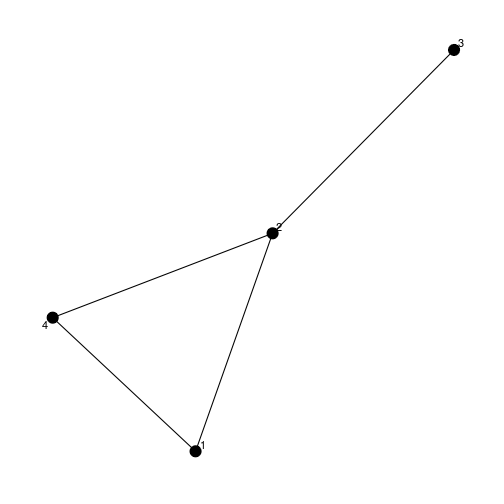
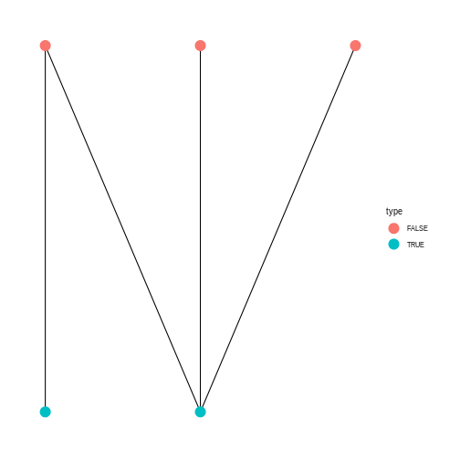

# Objectives

- Learn what we mean by "graph."
- How to make a graph from fossil occurrence data.
- Become familiar with the `igraph` package.
- Learn some basic network summary statistics.
- Introduce the basics of community detection algorithms.


This tutorial/primer is inspired and based on material presented in [this blog post](https://www.jessesadler.com/post/network-analysis-with-r/), [this tutorial](http://kateto.net/networks-r-igraph), the [`igraph` documentation](http://igraph.org/r/), the [`tidygraph` documentation](https://cran.r-project.org/web/packages/tidygraph/index.html), and the [`ggraph` documentation](https://cran.r-project.org/web/packages/ggraph/index.html).


# `igraph`

`igraph` is a large library of graph theory related functions which is available for C, python, and R. We will be using the R package, but much of what we will cover is general in nature. Additionally, most packages that interface with igraph have joint documentation -- you'll need to understand `igraph` in order to use `tidygraph`.

`igraph` began development well before the tidyverse, so it does not natively support a lot of the grammar we might be used to. The packages `tidygraph` and `ggraph` fill-in this missing functionality. 


```r
library(tidyverse)
library(igraph)
library(ggraph)
library(tidygraph)
```


# What is a "graph?"

A graph is a set of objects and in which some pairs of the objects are "related." The objects are called nodes (or verticies) and pairs of nodes are related by edges (or links). These edges can be either directed or undirected. While there are many kinds of graphs, all are representations of relational data.

A typical graph can be expressed as an ordered pair of vectors $G = (V, E)$, with $V$ being the set of nodes and $E$ being set of edges, each of which is defined by the related pair of nodes. The order of a graph is the number of nodes in the graph, $|V|$. The size of a graph is the number of edges in the graph, $|E|$.

First, we're going to practice making graphs by hand. This activity will prepare us for making graphs from our actual data. Let's start with the graph defined
$$
\begin{align}
  V &= \{1, 2, 3, 4\} \\
  E &= \{ \{1, 2\}, \{2, 3\}, \{2, 4\}, \{4, 1\} \}. \\
\end{align}
$$
Try drawing this graph out by hand first.


```r
edge_list <- tibble(from = c(1, 2, 2, 4),
                    to =    c(2, 3, 4, 1)) # define the relationships
node_list <- tibble(id = 1:4)          # name the nodes

g1 <- tbl_graph(nodes = node_list, 
                 edges = edge_list, 
                 directed = FALSE)

# what does this object *look* like?
print(g1)
```

```
## # A tbl_graph: 4 nodes and 4 edges
## #
## # An undirected simple graph with 1 component
## #
## # Node Data: 4 x 1 (active)
##      id
##   <int>
## 1     1
## 2     2
## 3     3
## 4     4
## #
## # Edge Data: 4 x 2
##    from    to
##   <int> <int>
## 1     1     2
## 2     2     3
## 3     2     4
## # ... with 1 more row
```

```r
ggraph(g1) + 
  geom_edge_link() +
  geom_node_point(size = 5) +
  geom_node_text(aes(label = id), repel = TRUE) +
  theme_graph() 
```

```
## Using `nicely` as default layout
```




## Bipartite graph

Bipartite graphs are a special type of graph that is particularly relevant to (paleo)biological analysis. In a bipartite graph the nodes are divided into two disjoint and independent sets, $U$ and $V$. Disjoint and independent means that nodes *within* each set do not share any connections, but that there are only connections between nodes of *different* sets. We ammend our earlier notation for a graph to $G = (U, V, E)$ to denote these two distinct sets of nodes.

Here is an example bipartite graph 
$$
\begin{align}
  U &= \{1, 2, 3\} \\
  V &= \{3, 5\} \\
  E &= \{ \{1, 4\}, \{1, 5\}, \{2, 5\}, \{3, 5\} \}. \\
\end{align}
$$
Try drawing this graph out by hand first.


```r
g2 <- make_bipartite_graph(types = c(0, 0, 0, 1, 1),  # node membership
                           edges = c(1, 4, 
                                     1, 5,
                                     2, 5,
                                     3, 5)) %>% # each line is an edge
  as_tbl_graph()

# what does this object *look* like?
print(g2)
```

```
## # A tbl_graph: 5 nodes and 4 edges
## #
## # A bipartite simple graph with 1 component
## #
## # Node Data: 5 x 1 (active)
##   type 
##   <lgl>
## 1 FALSE
## 2 FALSE
## 3 FALSE
## 4 TRUE 
## 5 TRUE 
## #
## # Edge Data: 4 x 2
##    from    to
##   <int> <int>
## 1     1     4
## 2     1     5
## 3     2     5
## # ... with 1 more row
```

```r
ggraph(g2, layout = 'bipartite') +
  geom_edge_link() +
  geom_node_point(aes(colour = type), 
                  size = 5) +
  theme_graph()
```




## Random graphs

Sometimes we want to generate a random graph instead of writing one out by hand -- it certainly makes writing examples easier! There are many ways to generate random graphs. `tidygraph` defines four types of "games," or ways to generate random graphs: component, evolution, sampling, and type. Here we will briefly discuss one example of each of these game types. None of these approaches are necessarily better than the others, but each can be very useful for many reasons. After all, truth only exists in simulation.


### Component games

Generate graphs that simulate a topology of connected subgraphs. 


```r
block_size <- c(30, 70)
pref_matrix <- matrix(c(0.1, 0.001, 0.001, 0.05), nrow = 2)

play_blocks(n = 100,                   # how many nodes
            size_blocks = block_size,  # size of each block
            p_between = pref_matrix)   # connectedness probability matrix
```

```
## # A tbl_graph: 100 nodes and 342 edges
## #
## # A directed simple graph with 1 component
## #
## # Node Data: 100 x 0 (active)
## #
## # Edge Data: 342 x 2
##    from    to
##   <int> <int>
## 1    12     1
## 2    15     1
## 3    24     1
## # ... with 339 more rows
```


### Evolution games

Create graphs through "evolutionary" mechanism (*not* biological)


```r
play_barabasi_albert(n = 100,          # number of nodes
                     power = 1)        # attachment power (default = 1)
```

```
## # A tbl_graph: 100 nodes and 99 edges
## #
## # A rooted tree
## #
## # Node Data: 100 x 0 (active)
## #
## # Edge Data: 99 x 2
##    from    to
##   <int> <int>
## 1     2     1
## 2     3     1
## 3     4     1
## # ... with 96 more rows
```


### Sampling games

Created directly by sampling of different attributes, topologies, etc.


```r
play_erdos_renyi(n = 100,              # nodes
                 p = 0.1)              # probability of edge occurring
```

```
## # A tbl_graph: 100 nodes and 965 edges
## #
## # A directed simple graph with 1 component
## #
## # Node Data: 100 x 0 (active)
## #
## # Edge Data: 965 x 2
##    from    to
##   <int> <int>
## 1    20     1
## 2    28     1
## 3    54     1
## # ... with 962 more rows
```


### Type games

There are based on there being different types of nodes and then simulating their interactions.


```r
play_bipartite(n1 = 30,                # nodes in "top" part
               n2 = 70,                # nodes in "bottom" part
               p = 0.1)                # probability of edge
```

```
## # A tbl_graph: 100 nodes and 218 edges
## #
## # A directed acyclic simple graph with 5 components
## #
## # Node Data: 100 x 1 (active)
##   type 
##   <lgl>
## 1 FALSE
## 2 FALSE
## 3 FALSE
## 4 FALSE
## 5 FALSE
## 6 FALSE
## # ... with 94 more rows
## #
## # Edge Data: 218 x 2
##    from    to
##   <int> <int>
## 1    10    31
## 2    13    31
## 3     7    32
## # ... with 215 more rows
```


# Working with graphs

```r
g2 <- play_erdos_renyi(n = 100,        # nodes
                       p = 0.1)        # probability of edge occurring
```

## Describing a graph


```r
g2 %>%
  mutate(degree = centrality_degree(),
         close = centrality_closeness(),
         eigen = centrality_eigen(),
         between = centrality_betweenness(),
         pagerank = centrality_pagerank())
```

```
## # A tbl_graph: 100 nodes and 1008 edges
## #
## # A directed simple graph with 1 component
## #
## # Node Data: 100 x 5 (active)
##   degree   close eigen between pagerank
##    <dbl>   <dbl> <dbl>   <dbl>    <dbl>
## 1     15 0.00498 0.870   280.   0.0150 
## 2      7 0.00412 0.515    73.5  0.00878
## 3      7 0.00427 0.497    81.3  0.00962
## 4     13 0.00469 0.564    89.1  0.00684
## 5      9 0.00429 0.584    94.1  0.00978
## 6      2 0.00346 0.318    20.1  0.00857
## # ... with 94 more rows
## #
## # Edge Data: 1,008 x 2
##    from    to
##   <int> <int>
## 1    10     1
## 2    19     1
## 3    23     1
## # ... with 1,005 more rows
```

```r
degree_distribution(g2)
```

```
##  [1] 0.00 0.00 0.00 0.00 0.00 0.00 0.00 0.00 0.00 0.01 0.00 0.01 0.00 0.01
## [15] 0.02 0.06 0.10 0.10 0.06 0.11 0.08 0.05 0.14 0.05 0.05 0.05 0.01 0.03
## [29] 0.03 0.01 0.00 0.01 0.00 0.00 0.01
```

```r
edge_density(g2)
```

```
## [1] 0.1018182
```

```r
diameter(g2)
```

```
## [1] 5
```

```r
get_diameter(g2)
```

```
## + 6/100 vertices, from 5d7656a:
## [1]  6 31 20 14 81 47
```


## Subgroups and communities


# Making a graph from PBDB occurrence data
